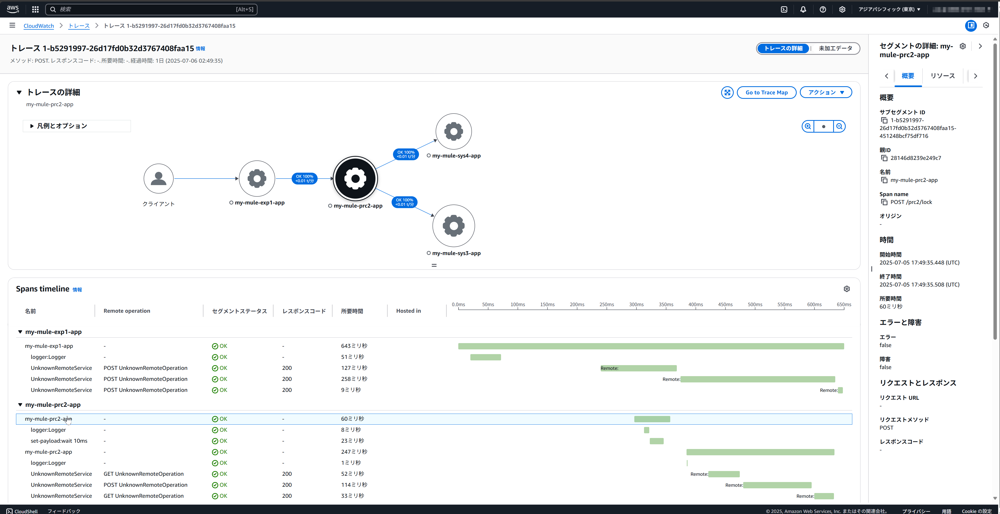
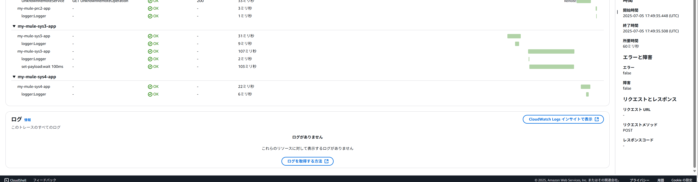
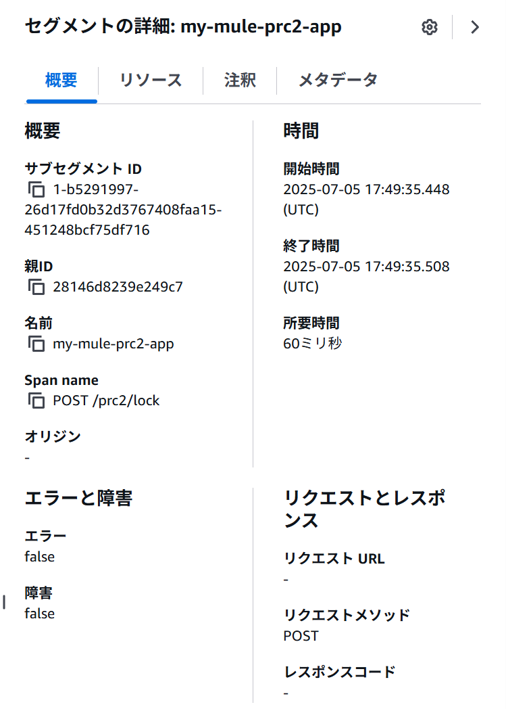
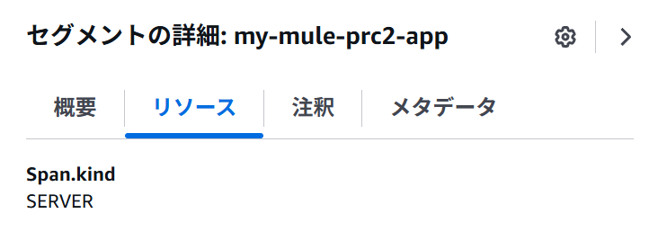
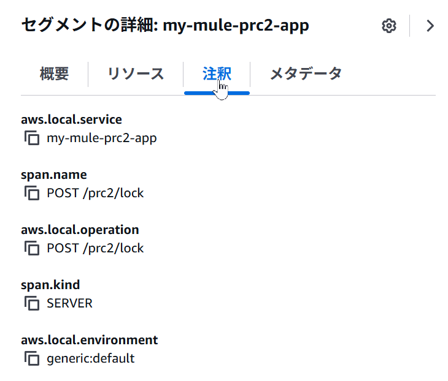
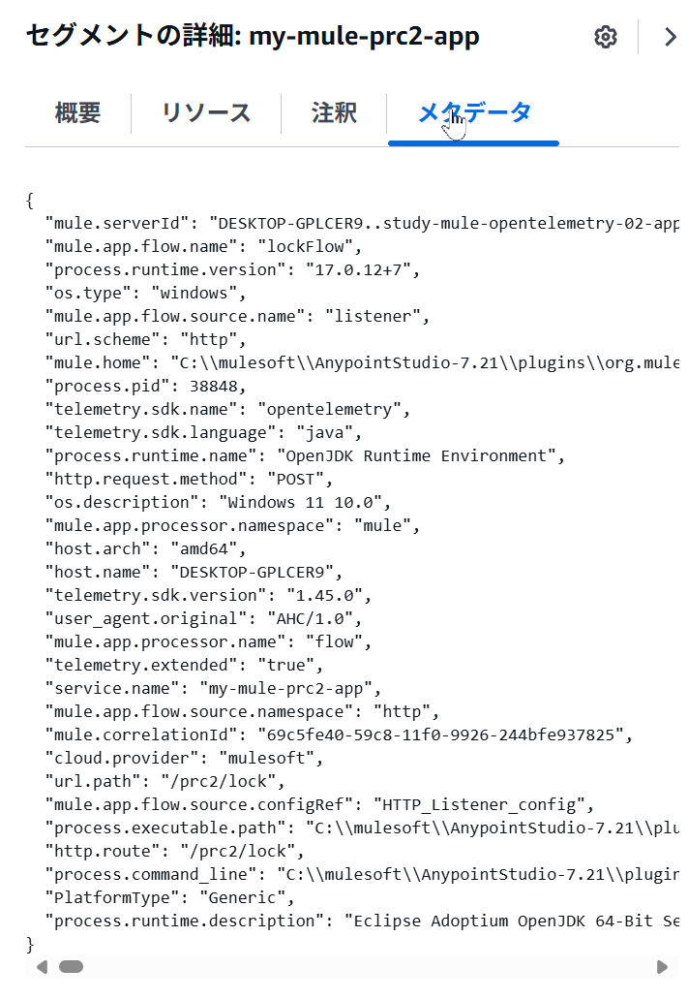
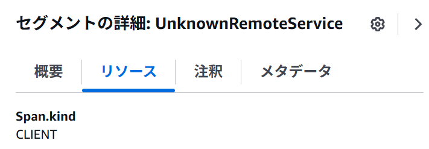
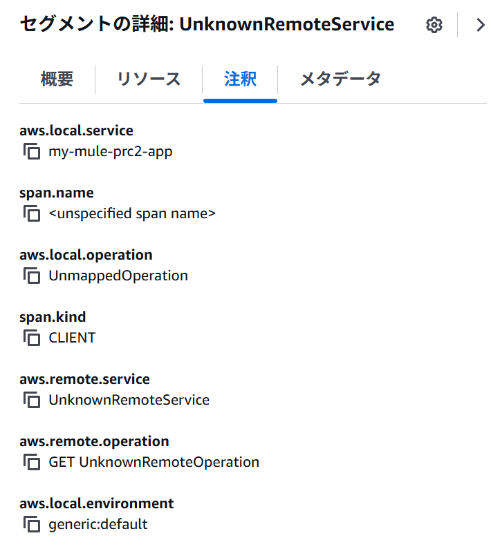
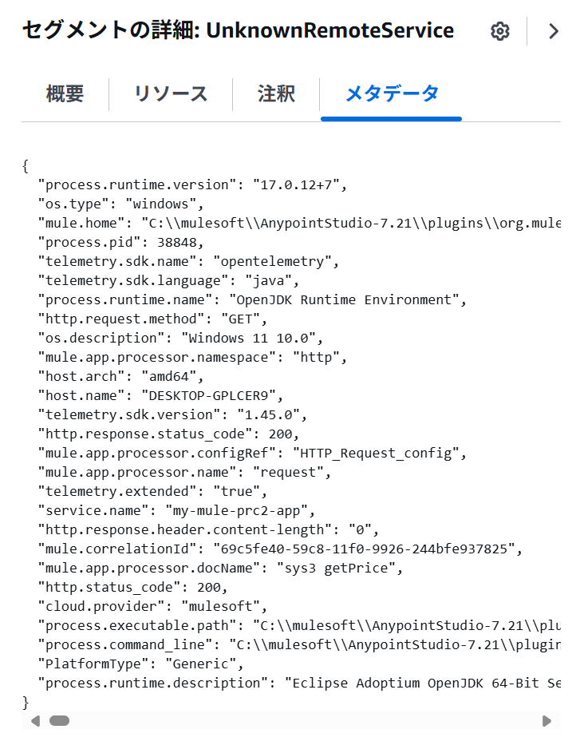

# Anypoint Platform の OpenTelemetry 対応状況

## 図解

## (1) 第3者のlibrary(avioconsultingさん) から New Relic
New Relic のtracesのトップページ

## (1)と(3) 第3者のlibrary(avioconsultingさん) → 自作中継Muleアプリ → AWS CloudWatch
 

名前が表示されるspanの詳細 

名前が「UnknownRemoteService」のspanの詳細 

